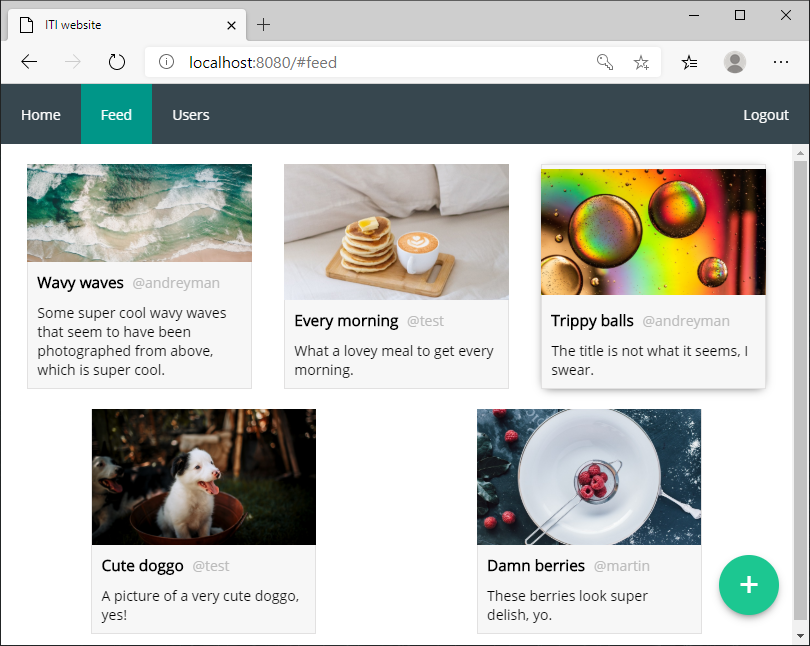

# ITI Assignment #1

## Table of Contents

* [Table of Contents](#table-of-contents)
* [Project description](#project-description)
	+ [Objectives](#objectives)
	+ [Directory structure](#directory-structure)
* [Usage](#usage)
	+ [Dependencies](#dependencies)
	+ [Configuration (Windows)](#configuration-windows)
		- [PHP](#php)
		- [MariaDB](#mariadb)
		- [Project](#project)
* [Acknowledgements](#acknowledgements)

## Project description

The assignment is to develop a responsive website built only using HTML, CSS, JavaScript, PHP & MySQL, which must contain at least one AJAX call. The only external library allowed is Font Awesome.



The site must contain the following pages/features:

- Frontpage
- Registration page
- Upload page
- Image feed
- User list

### Objectives

Various techniques have been implemented in this project with the overall objective to code idiomatically and experiment with various, modern web development technologies.

- Dynamic content loading with `#` navigation
- CSS themes / custom properties
- RegEx pattern matching (HTML5 `<input>`)
- Component based architecture (directory structure, HTML5 `<template>`)
- AJAX calls using ES6 Fetch API (`FormData` and `JSON`)
- Database interfacing using PDO's with sanitization
- Responsive design using media queries

### Directory structure

The directory structure is [inspired by][3] a web-application framework:

```
project
├── components      : component files
|   ├── comp.htm
|   └── ...
├── pages           : sub-pages
|   ├── page.php
|   └── ...
├── css             : styles
├── js              : client-side scripts
├── php             : server-side scripts
├── img             : graphic assets
└── index.php       : entry site
```

## Usage

### Dependencies

The website is developed for modern web-browsers on a local machine, using:

* [PHP (7.4.2)][php] - used for server-side scripting and database interfacing
* [MariaDB (10.4)][mariadb] - used as a local database server
* [HeidiSQL (10.2)][heidisql] - GUI for database server

### Configuration (Windows)

#### PHP

The latests PHP version binaries can be downloaded from the [PHP site][1], where it should be extracted into `C:\php\`. THe PHP directory should then [be added][2] to the `PATH` environment variable.

#### MariaDB

The MariaDB server installer can be downloaded from the [MariaDB site][4] as a MSI Package (`.msi`), which includes HeidiSQL for a GUI for the database server.

#### Project

The `migration.sql` file can be loaded into HeidiDB in order to load the database with test data, where the PHP configuration for the database is found in `/php/config.php`.

A PHP server can then be started from a project directory (where the `index.php` resides) using the command `php -S localhost:8080` and then accessed in the browser via the specified uri (`localhost:8080`).

The test database has three default users, `test`, `martin`, and `andreyman`, all with the password `Cakeman1`.

## Acknowledgements

A special thanks to:

- [@LangeHenrik](https://github.com/LangeHenrik) - the course supervisor

<!-- links -->

[1]: https://windows.php.net/download
[2]: https://www.forevolve.com/en/articles/2016/10/27/how-to-add-your-php-runtime-directory-to-your-windows-10-path-environment-variable/
[3]: https://medium.com/@nmayurashok/file-and-folder-structure-for-web-development-8c5c83810a5
[4]: https://downloads.mariadb.org/

[php]:  https://www.php.net
[mariadb]: https://mariadb.org/
[heidisql]: https://www.heidisql.com/


